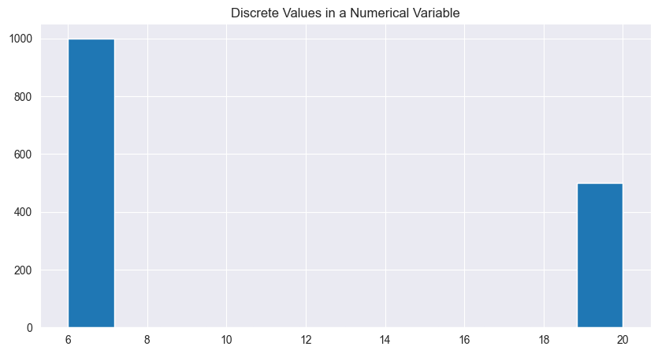

# What are the potential data risks/uncertainties that the AI engineer will be inheriting from the project?
Contributor: Tan Kwan Chet 

---
## Data Risks/Uncertainties

Having understood the business challenge and AI problem at hand, this is where you need to delve into understanding the data the sponsor has collected. You need to assess if there are risks/uncertainties posed within the data collected and annotated for solving the AI problem. Because a good AI model not only relies on algorithms but also quality data.

### Quote from Andrew Ng
> AI systems need both code and data, and “all that progress in algorithms means it's actually time to spend more time on the data,” Ng said at the recent EmTech Digital conference hosted by MIT Technology Review.

Here are 3 questions good for uncovering potential data risks/uncertainties:

1. Does the data include features that can predict the target?

It is important to identify if there are relevant features to construct the AI model. For example, in the case of detecting fraudulent transactions, these features may include, but not limited to, transaction amount and transaction purpose based on domain knowledge. Another way is to create a correlation plot (example chart below) between numerical features and the target variable where the relevant features have a correlation value that is not (or close to) 0. Or, you could plot a bivariate plot between categorical feature and the target variable to observe if there is any correlation. 

  

2. Do you have the label data?

Having labels is not sufficient if the label proportion is imbalanced. This would result in training an AI model biased towards the majority class. This is because the AI model is trained on limited examples to identify the minority class. But, if it is a regression target, it is ideal to have different ranges of values. You want to avoid training a regression model on the data that has clear discrete values (in the chart below). For examples, if you observe the target variable centres around 1 or 2 values such as 5 or 10, then it would be better to treat the variable as a categorical one. 

  

3. Do you have the correct granularity of the data?

It is critical to ensure that the training data and production data share the same level of granularity (e.g. hourly, daily, weekly, monthly or yearly) as what your sponsor expects in prediction. So if the sponsor expects the prediction on an hourly basis and the sponsor collects the data daily, then it will not be possible to build such an AI model to produce a granular prediction based on aggregated data. It is also worthy to note that if expected prediction is at a higher or similar granularity as the training or production data, then it is possible to build an AI model. 

  

## References 
- [MLOps-From-Model-centric-to-Data-centric-AI](https://www.deeplearning.ai/wp-content/uploads/2021/06/MLOps-From-Model-centric-to-Data-centric-AI.pdf)
- [Why it’s time for 'data-centric artificial intelligence'](https://mitsloan.mit.edu/ideas-made-to-matter/why-its-time-data-centric-artificial-intelligence)
- [Is My Data Any Good? A Pre-ML Checklist](https://services.google.com/fh/files/blogs/data-prep-checklist-ml-bd-wp-v2.pdf)