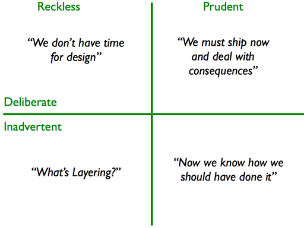

# What are the factors/considerations/criteria to consider that will reduce potential technical debt?

Contributor(s): Dylan Poh Guan Kiong

## What is technical debt?
In software development, technical debt is the accumulation of continuous expenses and it occurs when software engineers prioritize speed of deployment over all other development factors. Fast builds can cause problems that can be very difficult to resolve in the future.

Similar to financial debt, technical debt that is not repaid can accrue "interest," which makes it more expensive to make modifications in future. However, it might not always be a bad thing as developer might intentionally cut corners to produce proof of concept to advance initiatives.

Martin Fowler offers a more detailed analyses of technical debt quadrant:

|                             |
| :--------------------------------------------------------------------------------------------: |
| *Technical Debt Quadrant [Source](https://martinfowler.com/bliki/images/techDebtQuadrant.png)* |

## Deliberate and prudent technical debt

Deliberate vs inadvertent:
AI engineers may deliberately choose to cut corners, knowing that it would cost them in the long run. For instance, the developer may choose to build and deploy a model without investing in a framework or pipeline, choosing quick release over maintainability. In other words, they consciously trade off now gains for future expenses.
Junior AI engineers might not fully appreciate the benefit of using version control system and inadvertently decide to develop without the relevant tools.Only finding it impossible to roll back the code when the pipelines are broken.

Prudent vs reckless:
Some engineering choices, like rapidly prototyping a large number of models to choose the best algo, hence overlooking a maintainable pipeline could be a prudent decision. Knowing sound software development principles but writing spaghetti code because of tight schedule could result in reckless debt.

## Technical Debt in Machine Learning.

## References

- [Machine Learning: The High-Interest Credit Card of Technical Debt](https://storage.googleapis.com/pub-tools-public-publication-data/pdf/43146.pdf)
- [Hidden Technical Debt in Machine Learning Systems](https://proceedings.neurips.cc/paper/2015/file/86df7dcfd896fcaf2674f757a2463eba-Paper.pdf)