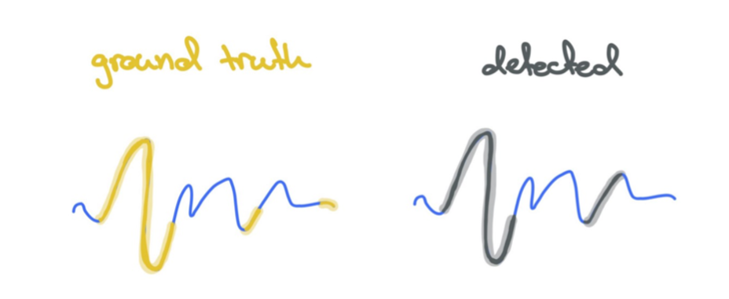
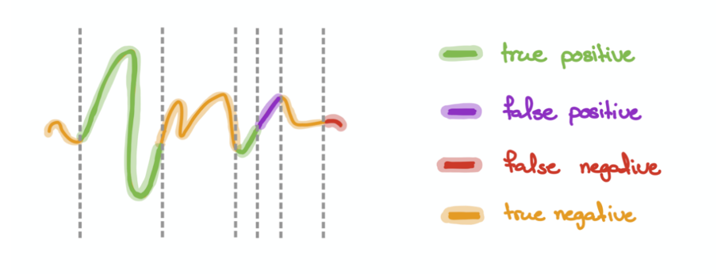

# How can we better evaluate Time-Series models?

Contributor(s): Andy Ong, AI Engineer

This guide assumes that you have a fair understanding of the typical classification evaluation metrics.

# Time-Series Classification

Time-Series models can be evaluated using conventional regression and classification evaluation metrics. For regression problems, we can use Mean Squared Error(MSE) or Root Mean Square Error(RMSE) to evaluate. Recall, precision or F1 Score can be used to evaluate classification models, depending on the business needs. 

For a time-series classification project, the typical approach is to view every timepoints individually. We will then evaluate the model by looking at its F1 Score or precision and recall (similar to a normal classification problem). However, this can be very sensitive in a Time-series setting.

Thus, these evaluation metrics might not be sufficient to properly evaluate Time-Series models. In this guide, I will talk about different approaches that can be taken to evaluate Time-Series models.

## Time Segments

Taking the above time-series ground truth and detection as an example, we have three ground truth anomalies, and 2 predicted anomalies.

In this approach, we will view every timepoints in segments. In the graph below, there are 7 segments, which consist of 2 True Positives, 1 False Positive, 1 False Negatives and 3 True negatives. By viewing our timepoints as segments, we can have a less sensitive yet strict approach.

    
## Overlapping segment

Another way would be to view any “overlapping” predictions between the ground truth and predictions as 1 continuous True Positive.

Taking the above graph as an example, We can see that there are 2 True positives recorded. Note that there is no FPs recorded as the ground truths and the detected is overlapped. This approach is more lenient, and it rewards the model for any successful detection of anomalies (True Positives).

## Case Study

The ground truth and model prediction values for Company A’s newly built Time-Series Anomaly Detection model are as follows:

|              | T = 0 | T = 1 | T = 2 | T = 3 | T = 4 | T = 5 | T = 6 | T = 7 |
|--------------|------ |------ |------ |------ |------ |------ |------ |------ |
| Ground Truth |   0   |   0   |   1   |   1   |   0   |   0   |   0   |   1   | 
| Detected     |   0   |   0   |   0   |   1   |   0   |   1   |   0   |   1   |

*1's are denoted as Anomaly for this case study*

The confusion matrix are calculated using Time Segment and Overlapping Segment approach.

| Approach     | Confusion Matrix                      | Recall                |
|--------------|---------------------------------------|---------------------- |
| Time Segment | TP = 2, FP = 1, TN = 3, FN = 1        | Recall = 2 / 3 (0.66) |
| Overlapping Segment | TP = 2, FP = 1, TN = 3, FN = 0 | Recall = 2 / 2 (1.00) |

From the table above, we can see that the overlapping approach resulted in a recall of 1.0, being more lenient as compared to the weighted segment. As Company A is planning to use the model for machinery failure detection, it is not wise to use such a lenient approach like overlapping segment. Instead, the time segment approach will be more appropriate. 

# Conclusion

While the approaches mentioned in this guide has their advantages, business needs must be taken into consideration while deciding which approach is suitable for your project. 
