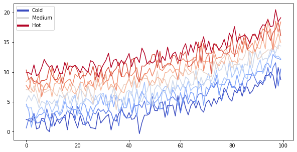

[comment]: <> (Use question as section title)
# How should I write a section using Markdown?
Contributor: Kenny WJ Chua  

---

This is a Markdown template/contribution guide for a section within a chapter. Alternatively, sections can be written in [Jupyter notebooks](../notebooks/notebook-template.ipynb).

## Content
We want to focus on content that can stand the test of time. Examples include process frameworks, general principles, strategies and design patterns.

As far as possible, content should stay agnostic with respect to specific tools,algorithms or techniques, as these tend to get update frequently. However, we can make minimal use of *examples* from a specific tool/algorithm/technique to *illustrate* a more general, agnostic point.

To keep things short, sharp and sweet, each section should be no longer than **500 words**.

## Language and style
We want to write contributions in continuous prose. Use bulleted points sparingly.

Singular first person pronouns should be used; while readers can be addressed in the second person. Example: **I** would like to seek **your** cooperation in standardising the use of pronouns in this handbook.

Contractions should be avoided (e.g., "let us" instead of "let's").

Avoid AISG-specific terminology, e.g., "100E", "AI Apprentices". Use neutral alternatives such as "AI/ML project" and "junior developers", respectively, that a general, external audience can better understand.

Contributions shall be written in Singaporean Standard English, which uses British spelling.

## Code blocks, figures and tables
Code blocks, figures and tables do not need to be numbered or captioned. These appear after first mention in main text. For example, refer to the code and plot below:

```python
from matplotlib import rcParams, cycler
import matplotlib.pyplot as plt
import numpy as np
plt.ion()

# Fixing random state for reproducibility
np.random.seed(19680801)

N = 10
data = [np.logspace(0, 1, 100) + np.random.randn(100) + ii for ii in range(N)]
data = np.array(data).T
cmap = plt.cm.coolwarm
rcParams['axes.prop_cycle'] = cycler(color=cmap(np.linspace(0, 1, N)))


from matplotlib.lines import Line2D
custom_lines = [Line2D([0], [0], color=cmap(0.), lw=4),
                Line2D([0], [0], color=cmap(.5), lw=4),
                Line2D([0], [0], color=cmap(1.), lw=4)]

fig, ax = plt.subplots(figsize=(10, 5))
lines = ax.plot(data)
ax.legend(custom_lines, ['Cold', 'Medium', 'Hot']);
```

  

## References
There is no requirement for formal in-text citations or bibliographies. If you need to make references to other texts, you can add a [link](https://en.wikipedia.org/) like this. Alternatively, you can have a short reference subsection at the end of your section like this:

- [This is a link to Wikipedia](https://en.wikipedia.org/)

foobar